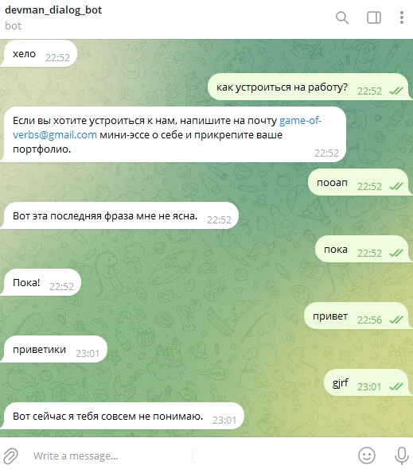
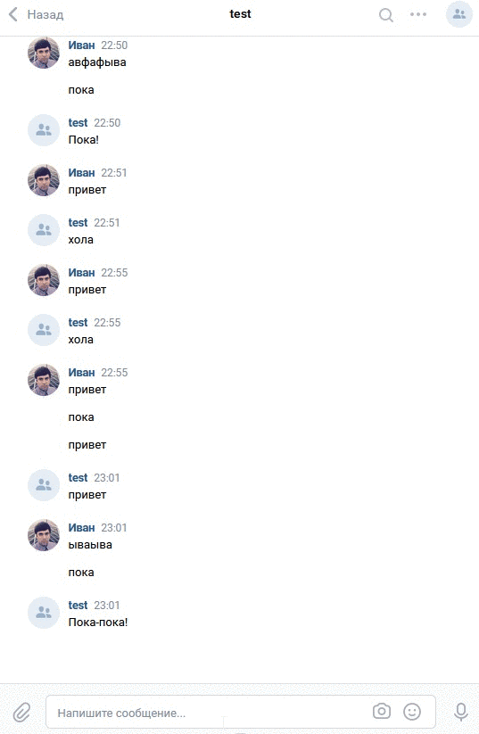

## Google "Dialogflow", telegram bot, vk bot

Google сервис Dialogflow интегрирован с telegram и vk.

## Подготовка проекта

- Создайте группу вконтакте для получения токена -> [vk API](https://vk.com/dev/bots_docs).
- Выполните описанные условия для создания Google проекта [google cloud](https://cloud.google.com/dialogflow/docs/quick/api) и создайте [dialogflow agent](https://cloud.google.com/dialogflow/docs/quick/api).
- Получите все токены/ключи для заполнения `.env` файла.
```
TOKEN_TG_BOT=123 - токен бота в телеграм
GOOGLE_APPLICATION_CREDENTIALS=C:\Users\User\AppData\Roaming\gcloud\application_default_credentials.json - путь до json файла от Google Cloud
GOOGLE_CLOUD_PROJECT=123 - Ваш Google Cloud project id
VK_TOKEN_GROUP=123 - токен группы Вконтакте
ADMIN_CHAT_ID=123 - Ваш id в телеграм для уведомлений
```

## Запуск

Для запуска телеграм бота используйте следующую команду:
```
python telegram_bot.py
```
Пример работы бота:



Для запуска вконтакте бота используйте следующую команду:
```
python vk_bot.py 
```
Пример работы бота:


#### Для обучения Dialogflow агента предусмотрен скрипт df_learning.py

Для запуска выполните команду:
```
python df_learning.py
```
Пример json файла:

```{
    "Устройство на работу": {
        "questions": [
            "Как устроиться к вам на работу?",
            "Как устроиться к вам?",
            "Как работать у вас?",
            "Хочу работать у вас",
            "Возможно-ли устроиться к вам?",
            "Можно-ли мне поработать у вас?",
            "Хочу работать редактором у вас"
        ],
        "answer": "Если вы хотите устроиться к нам, напишите на почту game-of-verbs@gmail.com мини-эссе о себе и прикрепите ваше портфолио."
    },  ...
```
